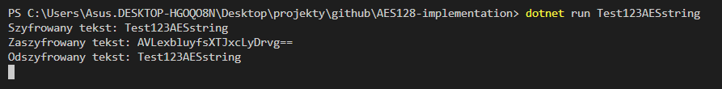

AES128 algorithm implementation in C# (.NET Core 2.2), usable through cli interface. To use this simply run it using:

```dontet run yourAESstring123```

First argument is the string to encrypt/decrypt.

As this implementation doesn't do any padding, you need to pass a valid string that contains 16 characters.

